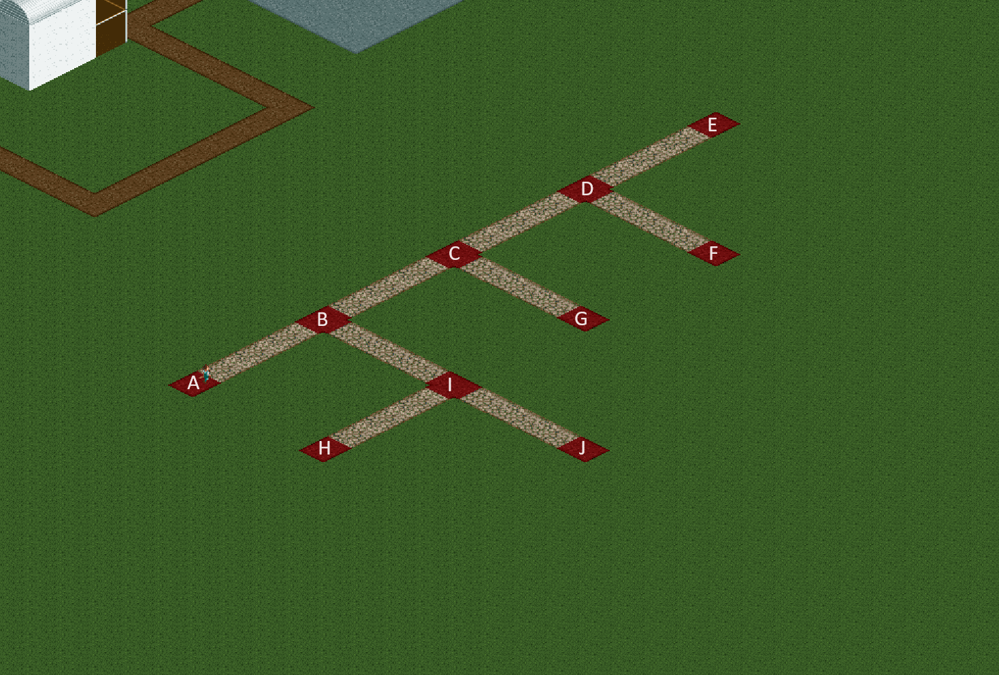
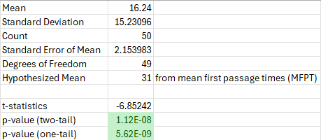

**Roller Coaster Tycoon 2, Handyman Case Study**

For this week’s project, I went a little bit outside of my comfort zone, and tackled some probability, statistics, and big scary words like Markov chains. But why all of this out of the blue? Funnily enough, I was playing Roller Coaster Tycoon 2 (OpenRCT2) this weekend, and I was reminded of a nagging question I’ve always had about handymen’s seemingly random pathing. Are they walking around randomly within their assigned route, or are they programmed to be a little more efficient than random?

<p align="center">
  
</p>

In the beginning, I wanted to first explore the probability that a handyman would get from point A to point B in N number of steps (in the code it’s actually N-1). To start I created a sample path with 10 “nodes” and intersections, A through J, and converted it to an adjacency list representation on Python. With that, the algorithm to calculate the probability is the following:

>*Input: graph, total steps, current step, source, and destination.*
>
>*Base case 1: If the node itself is the destination, then return 1.*
>
>*Base case 2: If the node is at maximum steps (N-1), return 1 if it is the destination. Otherwise return 0.*
>
>*Recursive step:  the probability of reaching the destination node within N-1 (where N is the length of the list of visited nodes) total steps from any given intermediate node at n current steps is equal to the sum of probabilities of its neighbors reaching the destinations at n+1 steps divided by the degree of the current node. Return the result.*

To verify the validity of this algorithm, I also ran a random walk simulation on the graph, and it turns out to be fairly accurate. Both the probability and simulation algorithms are provided in the python file.

Unsurprisingly, this really didn’t tell me much about handyman pathing. So, I turned to a different metric: average number of steps to get from one point to another. Not knowing how to derive this theoretically, I first ran a similar random walk simulation, but this time I looked for the average number of steps to get from one point to another. For example, starting from node A, it took on average 31 steps to get to node H. I was, however, stubborn about deriving this figure mathematically, so I eventually looked into Markov chains and the mean first passage times (MFPT). Unlike the simulations, MFPT can simultaneously calculate the average time between source and destination nodes for all combinations of source and destination nodes (except between a node and itself). To achieve this, the graph needs to be converted to an n x n transition matrix where n is the number of nodes, and an element at (i, j) represents the probability of transitioning from i to j. Then at each iteration for an arbitrary number of iterations, the transition matrix is updated by applying this equation:

```math
M_{ij} = 1 + \sum_{k\neq j}^{}P_{ik}M_{kj}
```
The results from MFPT match the results from random simulations!

Now that we finally established hypothetical means to get between two points, we can now compare it to real experiments from the game. To do this, I ran 50 tests by setting the handyman at node A and counting the number of steps the handyman took to get to node H. Next, knowing that the MFPT from A to H is 31, I ran both one and two-tailed t-tests on the sample against the hypothetical mean of 31. Here are the results:

<p align="center">
  
</p>

Both the one-tail and two-tail tests were statistically significant, meaning the average number steps taken from A to H is significantly lower than that resulting from random walk. Interesting!

Of course, this is by no means anything extraordinary. If it takes 16 steps to get from A and H and each step takes 5 seconds, that’s almost a minute and a half before Mr. Handyman can take care of all that vomit and trash in the vicinity of node H. This is not even accounting for weird behaviors such as handymen turning back around after cleaning one item, which further adds to the time it takes for handymen to get to desired destinations. Still, it was interesting to find out that the pathing wasn’t entirely random.

While checking to see if there’s any official information, I chanced upon an OpenRCT2 forum comment by one of the developers:

>Source - https://forums.openrct2.org/topic/999-peoples-path-finding-and-other-problems/
>
>Posted March 11, 2016 - Broxzier
>
>There are places where the RCT2 AI gets stuck, and different places where the OpenRCT2 AI gets stuck. I do agree that the OpenRCT2 AI needs some more help in certain places, and the developers are well aware of it. There are plans for completely rewriting the path-finding with quite advanced algorithms already. In the second podcast, the one from December or early January, some ideas about it were mentioned.
>
>Handymen basically walk around randomly within their area, their code has been decompiled quite recently. Just like peep AI there are plans for improving this. This is not a simple task, so don't expect it to happen soon. Right now we mostly stuck with this behaviour and sometimes make small changes to make it more acceptable.
>
>I haven't experienced the often ride breakdowns myself, I think it's in line with vanila RCT2.

Seeing as how this was posted almost 8 years ago, there was a reason to believe the non-randomness is introduced by the OpenRCT2 mod, so I went ahead and did the same experiment with the original RCT2. This time I ran a two-sample t-test between the previous sample and the new sample and got a p-value of 0.23. So, for now we can’t definitively say there’s been a change to the handyman path behaviors, but another way to look at this is that the original game already implemented some form of TSP approximation, and I think that’s pretty cool for an early 2000s game.
